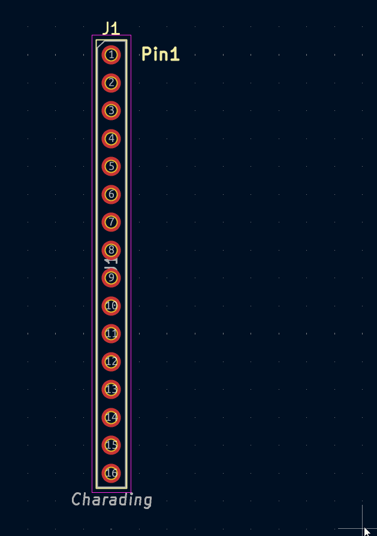
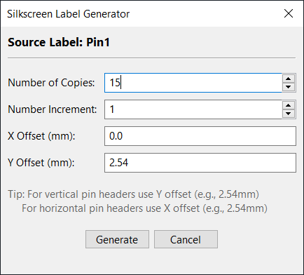

# KiCad Silkscreen Label Generator Plugin

A KiCad PCB Editor plugin that automates the creation of incremental silkscreen labels for pin headers and other components.

## Features

- 🔢 **Automatic Number Incrementing**:  
     Automatically increments numbers in silkscreen labels (e.g., HE0 → HE1 → HE2)
- 📏 **Custom Offsets**:  
     Set X and Y offset values for precise label positioning
- 🎯 **Flexible Increment Values**:  
     Choose any increment value (1, 2, 5, 10, etc.)
- 🔄 **Batch Generation**:  
     Create multiple labels at once (up to 1000)
- 💡 **Smart Text Handling**:  
     Works with or without existing numbers in labels
- ✨ **Multiple Selection Support**:  
     Select multiple silkscreens and generate from each one

 

## Use Cases

Perfect for:
- Pin headers (2.54mm pitch)
- Terminal blocks
- Connector labels
- Test points
- Any repeated labeling tasks

 

## Usage

### Step 1: Create or Select a Silkscreen Label

1. Open your PCB in KiCad PCB Editor
2. Add a silkscreen text label (or select an existing one)
   - Example: "HE0" for a header starting at pin 0
   - Or: "PIN1" for a pin starting at 1
   - Or even: "HEADER" (plugin will add numbers automatically)

### Step 2: Run the Plugin

1. Select the silkscreen label you want to duplicate
2. Click on **Tools → External Plugins → Silkscreen Label Generator**
   - Or find it in the toolbar if enabled

### Step 3: Configure Parameters

The dialog will show your selected label and these options:

- **Number of Copies**: How many labels to generate (default: 10)
- **Number Increment**: How much to increment each number (default: 1)
- **X Offset (mm)**: Horizontal spacing between labels (default: 0.0)
- **Y Offset (mm)**: Vertical spacing between labels (default: 2.54)

### Step 4: Generate

Click **Generate** and the plugin will create all your labels!

## Tips

- The original selected label is **not** modified
- All generated labels inherit properties from the source (font size, layer, style, etc.)
- Labels are added to the same silkscreen layer as the source
- You can use negative offsets to generate labels in the opposite direction
- Use X and Y offsets together for diagonal arrangements

## Requirements

- KiCad 6.0 or later (tested with KiCad 7.0+)
- Python 3.x (included with KiCad)
- wxPython (included with KiCad)

## Version History

- **1.0.0** - Initial release
  - Basic label duplication and incrementing
  - GUI dialog for parameter input
  - Support for X and Y offsets
  - Flexible increment values
